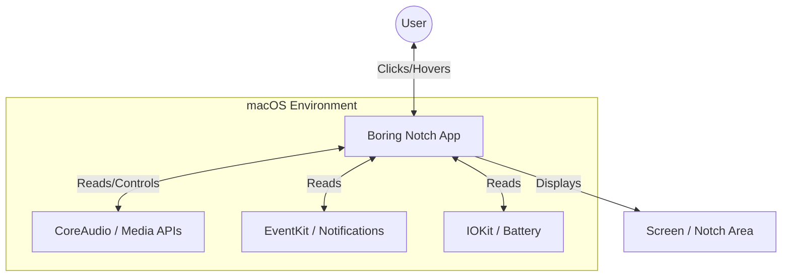
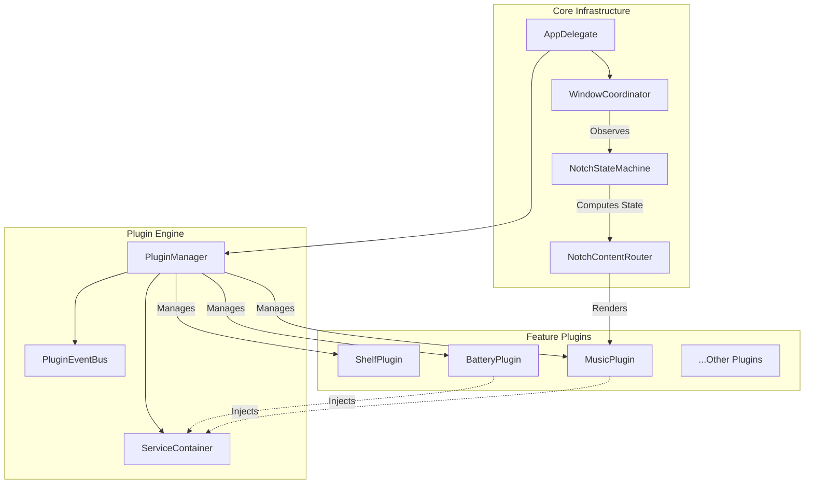
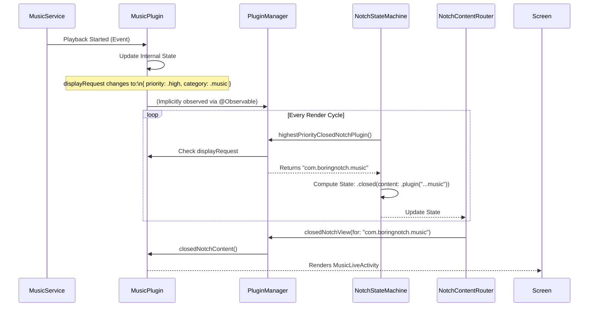
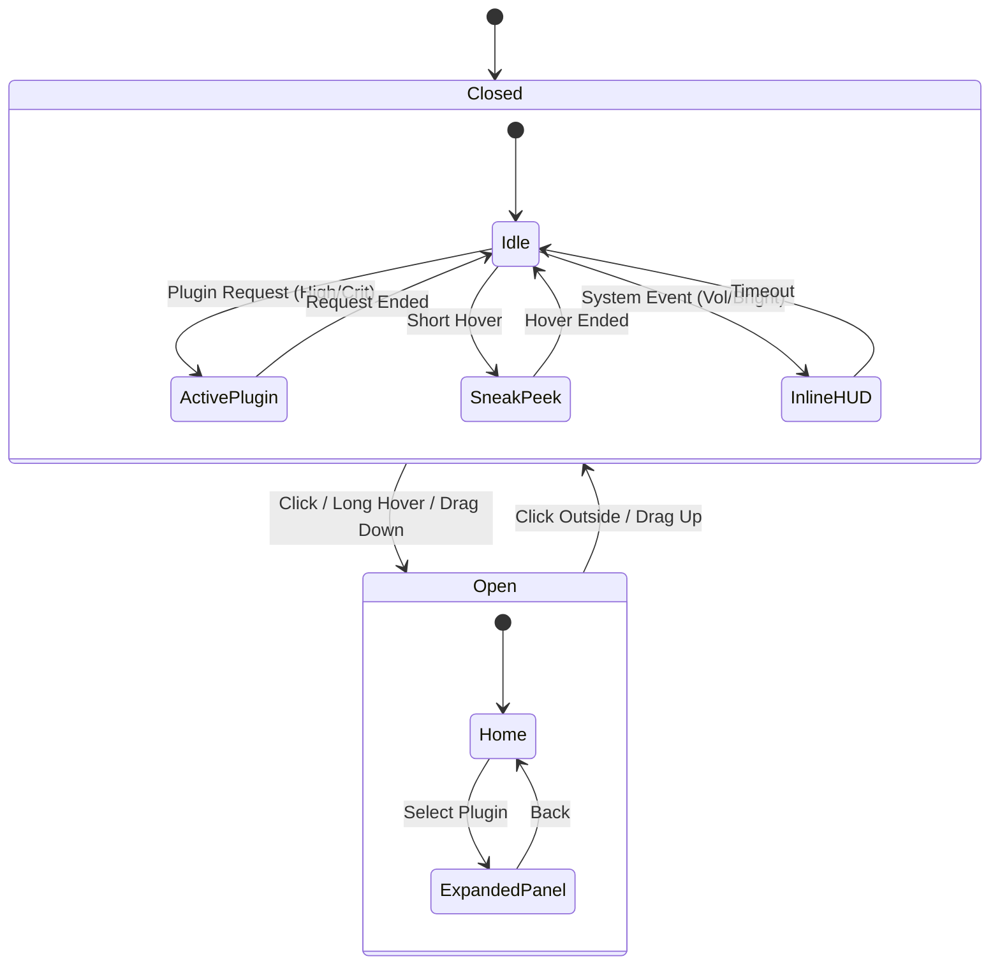
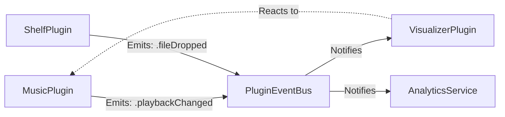

# Architecture Overview

> **Note:** This document reflects the system architecture as of January 2026 (v1.0 Plugin System).

Boring Notch is a macOS application designed to transform the static camera notch into a dynamic, interactive utility hub. The architecture is built on a **modular, plugin-first** foundation, ensuring extensibility, testability, and separation of concerns.

---

## 🏗 System Context (C4 Level 1)

At the highest level, boringNotch sits between the user, the macOS system, and external services.



---

## 🧩 Container Architecture (C4 Level 2)

The application is divided into three main layers: **Core Infrastructure**, **Plugin Engine**, and **Feature Plugins**.



### Key Components

1.  **PluginManager**: The brain of the extension system. It manages the lifecycle (load, activate, deactivate) of all plugins and acts as the central registry.
2.  **ServiceContainer**: A dependency injection container that holds all system services (`MusicService`, `BatteryService`, etc.). Plugins request services from here.
3.  **NotchStateMachine**: A pure logic component that determines *what* should be shown on the screen based on various inputs (is music playing? is battery low? is user hovering?).
4.  **NotchContentRouter**: The View layer component that maps the State Machine's output to actual SwiftUI views.

---

## 🧠 State Determination & Routing

One of the most complex parts of the system is deciding what to show in the closed notch. The system uses a **Priority-Based Arbitration** mechanism.

### The "Display Request" Flow

Plugins do not simply "draw" to the screen. They must **request** to be displayed.



### Priority Levels

1.  **Critical (30)**: Urgent system warnings (e.g., "Battery Low").
2.  **High (20)**: Active user engagement (e.g., "Music Playing", "Timer Running").
3.  **Normal (10)**: Passive information (e.g., "Weather").
4.  **Background (0)**: Idle state.

---

## 🚥 Notch State Machine Logic

The `NotchStateMachine` is the single source of truth for the notch's visual mode.



---

## 📡 Inter-Plugin Communication

Plugins are isolated by default but can communicate via the `PluginEventBus`. This decouples producers from consumers.



*   **Example**: The `VisualizerPlugin` doesn't need to know about `MusicPlugin`. It just listens for `playbackChanged` events on the bus.

---

## ⚡️ Concurrency Model

Structured concurrency (`async/await`) and Actors are strictly used to ensure thread safety.

| Component | Isolation | Reasoning |
|-----------|-----------|-----------|
| **NotchPlugin** | `@MainActor` | Plugins directly drive UI state, so they must stay on the main thread. |
| **Services** | `@MainActor` | Most system APIs (EventKit, etc.) are main-thread bound or updated via UI run loops. |
| **Workers** | `Task` / `actor` | Heavy lifting (image processing, network requests) is offloaded to background tasks. |

**Key Rule**: The main thread must never be blocked. If a plugin needs to fetch data (e.g., Weather), it must spawn a detached `Task`.

---

## 💾 Persistence Strategy

Plugins are sandboxed. `UserDefaults.standard` is not accessed directly.

*   **`PluginSettings`**: A wrapper around `Defaults` that namespaces keys.
    *   Plugin ID: `com.boringnotch.weather`
    *   Key: `showTemperature`
    *   Actual UserDefaults Key: `plugin.com.boringnotch.weather.showTemperature`

This prevents key collisions and facilitates resetting a specific plugin without wiping the entire app settings.

---

## 🔄 Data Flow Patterns

**Unidirectional Data Flow** is strictly adhered to.

1.  **System Event**: A system event occurs (e.g., Song changed).
2.  **Service Update**: The `MusicService` updates its `@Observable` properties.
3.  **Plugin Reaction**: The `MusicPlugin` (observing the service) updates its own state.
4.  **UI Render**: SwiftUI detects the change in the Plugin and re-renders the View.

**❌ Anti-Pattern (Avoid):**
*   Views observing singletons (`MusicManager.shared`).
*   Plugins directly modifying Views.

**✅ Correct Pattern:**
*   Views observe `Plugin`.
*   Plugin observes `Service`.
*   Service observes `System`.

---

## 📂 Directory Structure

```
boringNotch/
├── Plugins/
│   ├── Core/                 # Framework Definitions
│   │   ├── NotchPlugin.swift           # The Protocol
│   │   ├── PluginManager.swift         # The Registry
│   │   └── ServiceContainer.swift      # The Toolbox
│   │
│   ├── Services/             # System Integrations
│   │   ├── MusicService.swift          # Media Player API
│   │   ├── BatteryService.swift        # IOKit Wrapper
│   │   └── ...
│   │
│   └── BuiltIn/              # Feature Implementations
│       ├── MusicPlugin/
│       ├── BatteryPlugin/
│       ├── CalendarPlugin/
│       └── ...
│
├── Core/                     # App Lifecycle & Windowing
│   ├── NotchStateMachine.swift
│   ├── NotchContentRouter.swift
│   └── ...
```

---

## 🧪 Testing Strategy

The architecture is designed for testability.

*   **Unit Tests**: Plugins are tested in isolation by injecting **Mock Services**.
*   **Mocking**: Every Service is defined by a protocol (e.g., `MusicServiceProtocol`), allowing the injection of fake implementations that return controlled data.

### Example: Testing Music Display Logic

```swift
func testMusicPluginRequestsDisplay() async {
    // 1. Setup
    let mock = MockMusicService()
    let plugin = MusicPlugin()
    await plugin.activate(context: ...services: [music: mock]...)
    
    // 2. Action
    mock.playbackState.isPlaying = true
    
    // 3. Assertion
    XCTAssertEqual(plugin.displayRequest?.priority, .high)
}
```
